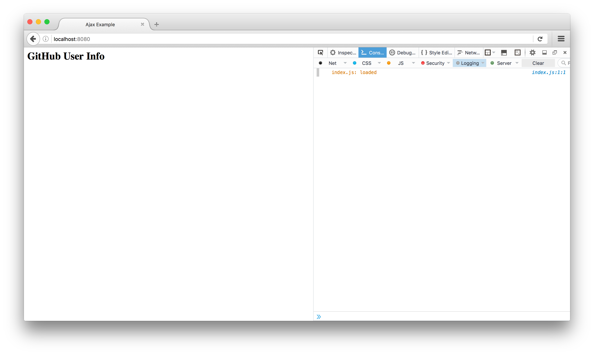

# エントリポイント

エントリポイントとは、アプリケーションの中で一番最初に呼び出される部分のことです。
アプリケーションを作成するにあたり、まずはエントリポイントを用意しなければなりません。

Webアプリケーションにおいては、常にHTMLドキュメントがエントリポイントとなります。
ウェブブラウザによりHTMLドキュメントが読み込まれたあとに、HTMLドキュメント中で読み込まれたJavaScriptが実行され、
アプリケーションが動作します。

## HTMLファイルの用意

エントリポイントとして、まずは最低限の要素だけを配置したHTMLファイルを作成しましょう。
`body`要素の一番下で読み込んでいるindex.jsが、今回のアプリケーションの処理を記述するJavaScriptファイルになります。

[import index.html](src/index.html)

index.jsには、スクリプトが正しく読み込まれたことを確認できるよう、ログを表示する処理だけを書いておきます。

[import index.js](src/index.js)

開発用のローカルサーバーを立ち上げて、ウェブブラウザでindex.htmlにアクセスしてみましょう。
ローカルサーバーを立ち上げずに直接HTMLファイルを開くこともできますが、その場合`file:///`から始まるURLになります。
`file`スキーマでは[Same Origin Policy][]により、多くの場面でアプリケーションは正しく動作しません。
本章はローカルサーバーを立ち上げた上で、`http`スキーマのURLでアクセスすることを前提としています。

index.htmlにアクセスすると、次の画像のようにログが出力されます。
Console APIで出力したログを確認するには、ウェブブラウザの開発者ツールを開く必要があります。
ほとんどのブラウザで開発者ツールが同梱されていますが、本章ではFirefoxを使って確認します。
Firefoxの開発者ツールは次のいずれかの方法で開きます。

- Firefox メニュー (メニューバーがある場合や Mac OS X では、ツールメニュー) の Web 開発サブメニューで "Web コンソール" を選択する
- キーボードショートカット Ctrl+Shift+K (OS X では Command+Option+K) を押下する

詳細は"[Webコンソールを開く][]"を参照してください。

[Same Origin Policy]: https://developer.mozilla.org/ja/docs/Web/Security/Same-origin_policy 
[Webコンソールを開く]: https://developer.mozilla.org/ja/docs/Tools/Web_Console/Opening_the_Web_Console