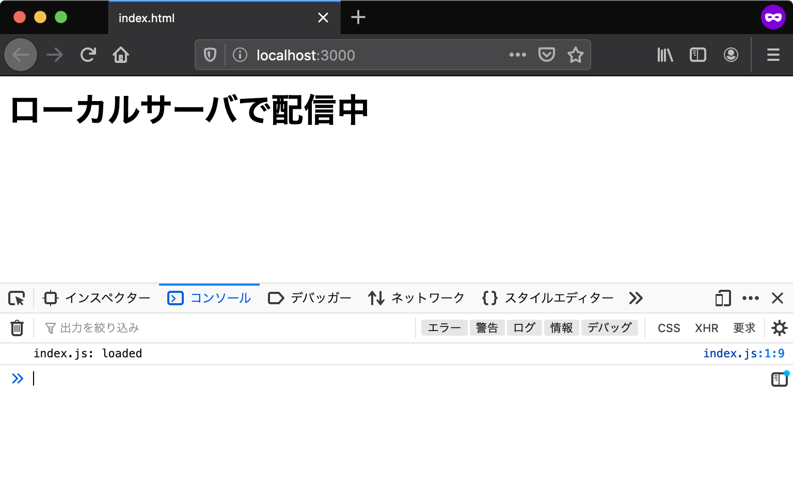

# アプリケーション開発の準備 {#setup-local-env}

これまでに学んだJavaScriptの基本構文は、実行環境を問わずに使えるものです。
しかしこの後に続くユースケースの章では、具体的な実行環境としてWebブラウザと[Node.js][]の2つを扱います。
また、ブラウザで実行するアプリケーションであっても、その開発にはツールとしてのNode.jsが欠かせません。
このセクションではユースケースの学習へ進むために必要なアプリケーション開発環境の準備をおこないます。

## Node.jsのインストール {#install-nodejs}

[Node.js][]はサーバーサイドJavaScript実行環境のひとつで、次のような特徴があります。

- WebブラウザのChromeと同じ[V8][] JavaScriptエンジンで動作する
- オープンソースで開発されている
- OSを問わずクロスプラットフォームで動作する

Node.jsはサーバーサイドで使うために開発されました。
しかし今ではコマンドラインツールや[Electron][]などのデスクトップアプリケーションにも利用されています。
そのため、Node.jsはサーバーサイドに限らずクライアントサイドのJavaScript実行環境としても幅広く使われています。

Node.jsは多くの他のプログラミング言語と同じように、実行環境をマシンにインストールすることで使用できます。
公式の[ダウンロードページ][]から、開発用のマシンに合わせたインストーラをダウンロードして、インストールしましょう。

Node.jsには**LTS（Long-Term Support）**版と最新版の2つのリリース版があります。
**LTS（Long-Term Support）**版は2年間のメンテナンスとサポートが宣言されたバージョンです。
具体的には、後方互換性を壊さない範囲でのアップデートと、継続的なセキュリティパッチの提供が行われます。
一方で、最新版はNode.jsの最新の機能を使用できますが、常に最新のバージョンしかメンテナンスされません。
ほとんどのユーザーは、LTS版を用いることが推奨されます。Node.jsでの開発が初めてであれば、迷わずにLTS版のインストーラをダウンロードしましょう。
この章では執筆時点の最新LTS版であるバージョン{{book.nodeversion}}で動作するように開発します。

インストールが完了すると、コマンドラインで`node`コマンドが使用可能になっているはずです。
次のコマンドを実行して、インストールされたNode.jsのバージョンを確認しましょう。

{{book.triplebackticks}}
$ node -v 
v{{book.nodeversion}}
{{book.triplebackticks}}

また、Node.jsには[npm][]というパッケージマネージャーが同梱されています。
Node.jsをインストールすると、`node`コマンドだけでなくnpmを扱うための`npm`コマンドも使えるようになっています。
次のコマンドを実行して、インストールされたnpmのバージョンを確認しましょう。

{{book.triplebackticks}}
$ npm -v 
{{book.npmversion}}
{{book.triplebackticks}}

npmや`npm`コマンドについての詳細は[公式ドキュメント](https://docs.npmjs.com/)や[npmのGitHubリポジトリ][]を参照してください。
Node.jsのライブラリのほとんどはnpmを使ってインストールできます。
実際に、ユースケースの章ではnpmを使ってライブラリをインストールして利用します。

## npxコマンドによるnpmパッケージの実行 {#npx-execution}

Node.jsを使ったコマンドラインツールは数多く公開されており、npmでインストールすることによりコマンドとして実行できるようになります。
ところで、Node.jsのインストールにより、[npx][]というコマンドも使えるようになっています。
`npx`コマンドを使うと、npmで公開されている実行可能なパッケージのインストールと実行がコマンドひとつで省略できます。
この後のユースケースでもそれらのツールを使うので、ここでツールの実行を試してみましょう。

ここでは例として[@js-primer/hello-world][]というサンプル用のパッケージを実行します。
`npx`コマンドでコマンドラインツールを実行するには、次のように `npx`コマンドにパッケージ名を渡して実行します。

```
$ npx @js-primer/hello-world
npx: 1個のパッケージを7.921秒でインストールしました。
Hello World!
```

このように、`npx`コマンドを使うことによりnpmで公開されているコマンドラインツールを簡単に実行できます。

### [コラム] コマンドラインツールのインストールと実行 {#command-line-tools-installation}

npmで公開されているコマンドラインツールを実行する方法は`npx`コマンドだけではありません。
`npm install`コマンドを使ってパッケージをインストールし、インストールされたパッケージのコマンドを実行する方法があります。
通常の`npm install`コマンドは実行したカレントディレクトリにパッケージをインストールしますが、`--global`フラグを加えるとパッケージをグローバルインストールします。
グローバルインストールされたパッケージのコマンドは、`node`コマンドや`npm`コマンドと同じように、任意の場所から実行できます。

次の例では`@js-primer/hello-world`パッケージをグローバルインストールしています。
その後、パッケージに含まれている`js-primer-hello-world`コマンドを絶対パスの指定なしで呼び出しています。

```
$ npm install --global @js-primer/hello-world
$ js-primer-hello-world
Hello World!
```

## ローカルサーバーのセットアップ {#local-server}

「[値の評価と表示][]」の章では、`index.html`と`index.js`というファイルを作成しブラウザで表示していました。
このときローカルに作成したHTMLファイルをそのままブラウザで読み込むと、ブラウザのアドレスバーは`file:///`から始まるURLになります。
`file`スキーマでは[Same Origin Policy][]により、多くの場面でアプリケーションは正しく動作しません。

次のユースケースの章で書いていくアプリケーションは、[Same Origin Policy][]の制限を避けるために、`http`スキーマのURLでアクセスすることを前提としています。
開発用のローカルサーバーを使うことで、ローカルに作成したHTMLファイルも`http`スキーマのURLで表示できます。

ここでは、次からのユースケースで利用する開発用のローカルサーバーをセットアップする方法を見ていきます。

### HTMLファイルの用意 {#preparing-html}

まずは`http`スキーマで表示したい、最低限の要素だけを配置したHTMLファイルを作成しましょう。
作成する`index.html`は`body`要素の一番下でJavaScriptファイルを読み込んでいます。

[import title:"index.html"](src/index.html)

`index.js`には、スクリプトが正しく読み込まれたことを確認できるよう、コンソールにログを出力する処理だけを書いておきます。

[import title:"index.js"](src/index.js)

### ローカルサーバーを起動する {#js-primer-local-server}

先ほど作成した`index.html`と同じディレクトリで、次の`npx`コマンドを実行します。
次のコマンドでは、`@js-primer/local-server`というローカルサーバーモジュールをダウンロードと同時に実行します。
このローカルサーバーモジュールでは、`http`スキーマのURLでアクセスできるように実行したディレクトリにあるファイルを配信します。

```shell-session
$ npx @js-primer/local-server
```
 
起動したローカルサーバーのURL（`http://localhost:3000`）へブラウザでアクセスすると、先ほどの`index.html`の内容が表示されます。



また、正しく`index.js`が読み込まれてるかを確認してみましょう。
Console APIで出力したログを確認するには、ウェブブラウザの開発者ツールを開く必要があります。
ほとんどのブラウザで開発者ツールが同梱されていますが、この書籍ではFirefoxを使って確認します。

Firefoxの開発者ツールは次のいずれかの方法で開きます。

- Firefox メニュー（メニューバーがある場合や macOS では、ツールメニュー）の Web 開発サブメニューで "Web コンソール" を選択する
- キーボードショートカット Ctrl+Shift+K（macOS では Command+Option+K）を押下する

詳細は"[Webコンソールを開く][]"を参照してください。

[Node.js]: https://nodejs.org/ja/
[V8]: https://developers.google.com/v8/
[Electron]: http://electron.atom.io/
[ダウンロードページ]: https://nodejs.org/ja/download/
[npm]: https://www.npmjs.com/
[npmのGitHubリポジトリ]: https://github.com/npm/cli
[npx]: https://blog.npmjs.org/post/162869356040/introducing-npx-an-npm-package-runner
[@js-primer/hello-world]: https://github.com/js-primer/hello-world
[@js-primer/local-serverパッケージ]: https://github.com/js-primer/local-server
[値の評価と表示]: ../../basic/read-eval-print/README.md
[Webコンソールを開く]: https://developer.mozilla.org/ja/docs/Tools/Web_Console/Opening_the_Web_Console